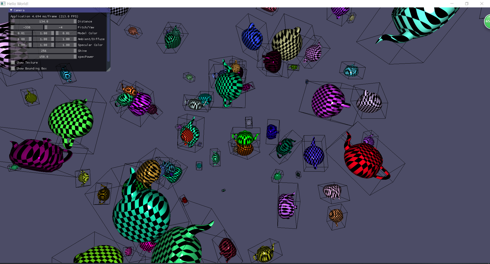

# Utah-Teapot
Basic rending using the Phong shader and has the ability to manipulate camera perspectives. The teapot is instanced 100 times with different positions, scales, rotations, and colors. This also includes a toggle to turn on/off textures and bounding boxes. 

This C++ project was made using cmake,ImGui and openGL in Visual studio 2019. All the linear algebra calculations were done using the opegGL glm math funcitons. 

- Phong lighting (also added a specular strength, somehow making it like 200 to 500 looks the best)
- Transformation
- 100 instance with different scale/pos/angle/color (all the instanced object had thier own light based on thier position in view)"instacned light is not right" vs instanced light is right" screenshot.
- Checkerboard texture (multiplyed the texture color with phone color) other ways cause the lighting to look weird
- Bounding box for the teapots (the bounding box helper method had some problums. it would not draw horizontal lines, so i had to modifiy it) 

